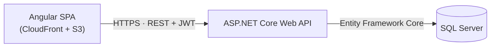
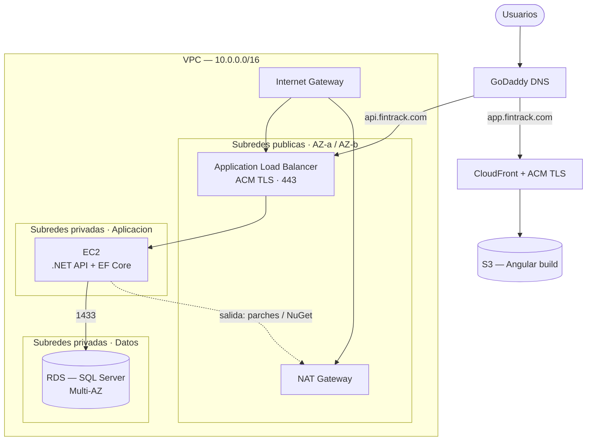
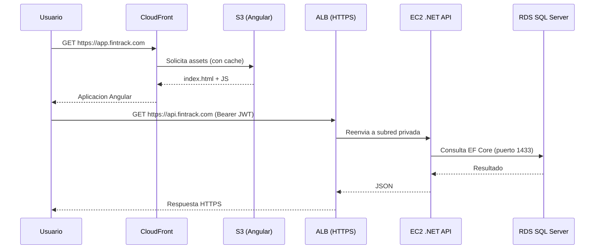

# Arquitectura

Arquitectura de **FinTrack**: una API en .NET con Entity Framework Core sobre SQL
Server, un frontend en Angular y un despliegue en AWS diseñado con foco en la
**seguridad de red** (VPC, subredes privadas, NAT y control de acceso por grupos
de seguridad).

> Este documento forma parte del assessment de seguridad. La sección de red y
> certificados es la más relevante para el análisis de riesgos posterior.

---

## Stack tecnológico

| Capa | Tecnología |
|------|------------|
| Frontend | Angular (SPA) |
| Backend | ASP.NET Core Web API (.NET) |
| ORM | Entity Framework Core |
| Base de datos | SQL Server |
| Nube | AWS (EC2, RDS, S3, CloudFront, NAT, VPC) |
| DNS | GoDaddy |
| Certificados | AWS Certificate Manager (ACM) |

---

## Arquitectura lógica

Separación clásica en tres capas: presentación, aplicación y datos.

- **Frontend (Angular)**: aplicación estática servida desde S3 a través de CloudFront.
- **Backend (.NET)**: API REST que valida JWT y expone la lógica de negocio.
- **Datos (SQL Server)**: acceso únicamente desde la capa de aplicación.

---

## Arquitectura en AWS (red / VPC)

El backend nunca se expone directamente a internet: queda en subredes privadas
detrás de un Application Load Balancer. La base de datos está aún más aislada, sin
salida a internet.

### Subredes y enrutamiento

| Subred | CIDR (ejemplo) | Ruta a internet | Contenido |
|--------|----------------|-----------------|-----------|
| Pública | `10.0.1.0/24`, `10.0.2.0/24` | Internet Gateway | ALB, NAT Gateway |
| Privada — App | `10.0.11.0/24`, `10.0.12.0/24` | NAT (solo salida) | EC2 con la API .NET |
| Privada — Datos | `10.0.21.0/24`, `10.0.22.0/24` | Ninguna | RDS SQL Server |

> Todas las capas se replican en **dos zonas de disponibilidad** (AZ-a / AZ-b)
> para alta disponibilidad.

---

## Grupos de seguridad (Security Groups)

Regla clave: los grupos referencian a **otros grupos**, no rangos de IP abiertos.
Así el acceso es de mínimo privilegio y encadenado por capa.

| Grupo | Origen permitido | Puerto | Propósito |
|-------|------------------|--------|-----------|
| `sg-alb` | `0.0.0.0/0` | 443 | HTTPS público hacia el balanceador |
| `sg-ec2` | `sg-alb` | 443 / 5000 | Solo el ALB alcanza la API |
| `sg-rds` | `sg-ec2` | 1433 | Solo la API alcanza SQL Server |

- La base de datos **no acepta conexiones** de nada que no sea la capa de aplicación.
- La API **no acepta conexiones** de nada que no sea el ALB.

---

## DNS y certificados SSL/TLS

El dominio se gestiona en **GoDaddy**, mientras que los certificados se emiten con
**AWS Certificate Manager (ACM)**.

- **Frontend** — `app.fintrack.com`: registro en GoDaddy apuntando (CNAME) a la
  distribución de CloudFront. El certificado ACM debe estar en la región
  `us-east-1` (requisito de CloudFront).
- **API** — `api.fintrack.com`: registro CNAME en GoDaddy apuntando al DNS del ALB.
  El certificado ACM se emite en la región del ALB.
- **Validación del certificado**: ACM entrega registros CNAME de validación que se
  agregan en el panel DNS de GoDaddy. Al propagarse, el certificado pasa a estado
  *Issued*.
- **Terminación TLS**: ocurre en CloudFront (frontend) y en el ALB (API). Las
  peticiones HTTP se redirigen a HTTPS.

---

## Consideraciones de seguridad

- **Defensa en profundidad**: tres capas de red (pública, privada-app, privada-datos)
  con acceso encadenado.
- **Sin superficie pública innecesaria**: EC2 y RDS no tienen IP pública. La única
  entrada desde internet es el ALB (443) y CloudFront.
- **Salida controlada**: la API sale a internet solo a través del NAT Gateway (para
  parches y dependencias), nunca acepta conexiones entrantes directas.
- **Mínimo privilegio**: los Security Groups referencian otros grupos, no CIDRs abiertos.
- **TLS de extremo a extremo**: certificados ACM en CloudFront y ALB; redirección HTTP → HTTPS.
- **Gestión de secretos**: cadena de conexión y clave JWT en AWS Secrets Manager o
  SSM Parameter Store, nunca en el repositorio.
- **Alta disponibilidad**: subredes en dos AZ y RDS en modo Multi-AZ.
- **Observabilidad**: CloudWatch, VPC Flow Logs y logs de acceso del ALB.
- **Extras recomendados**: AWS WAF sobre CloudFront/ALB y backups automáticos de RDS.
