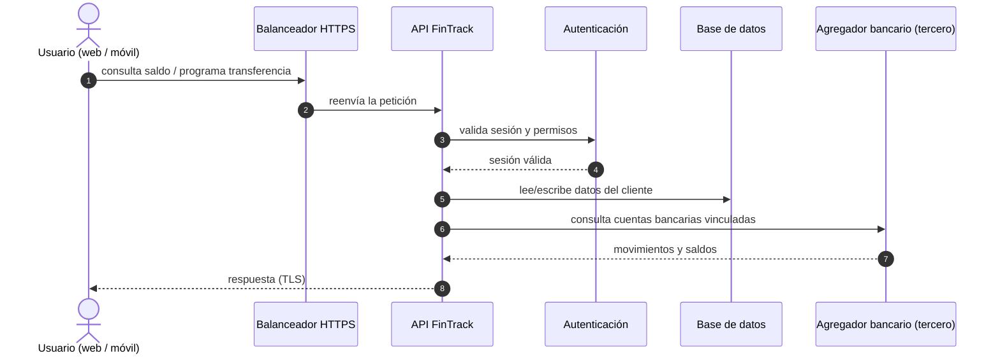
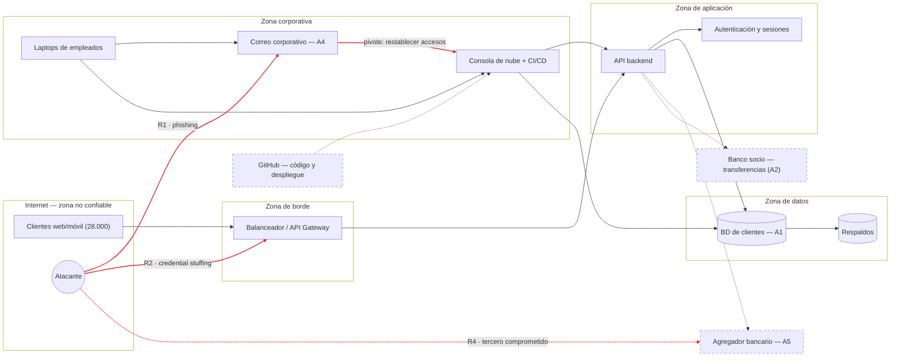

# 02 — Arquitectura y Superficie de Ataque

**Decisión que permite tomar este documento:** por dónde puede entrar un atacante a FinTrack y qué encuentra al entrar. Sin ese mapa, priorizar controles es adivinar.

Acompaña a las convenciones de `diagram-conventions.md`.

---

## El viaje de una petición

Antes de dibujar la red, hay que entender qué pasa cuando un cliente usa FinTrack. Cada paso del viaje es un lugar donde algo puede fallar — y donde un atacante puede meterse.

**Dónde puede fallar cada paso:**

| Paso | Qué puede salir mal | Riesgo |
|------|---------------------|--------|
| 1 | El "usuario" no es el usuario: credenciales robadas o reutilizadas de otra filtración | R2 |
| 3–4 | Una contraseña sola basta para abrir la sesión. Sin segundo factor, robar la credencial es robar la cuenta | R1, R2 |
| 5 | Quien llega a la base de datos (por la API o por la consola de administración) llega a los datos de 28.000 personas | R6 |
| 6–7 | FinTrack hereda la seguridad del agregador: si lo comprometen a él, comprometen los datos que FinTrack le confió | R4 |
| Todos | Nada de esto genera una alerta hoy. Si el paso falla, nadie se entera | R3 |

---

## Diagrama de la arquitectura

Zonas de confianza, terceros fuera y punteados, caminos de entrada en rojo.

**Lectura del diagrama:** la zona corporativa no está "detrás" de la aplicación — está al lado, y tiene llaves de todo. El correo de un empleado (A4) permite restablecer contraseñas de la consola de nube, y la consola de nube administra la API y la base de datos. Por eso el camino rojo más corto hacia A1 no cruza el balanceador: cruza una bandeja de entrada.

---

## Componentes

| # | Componente | Qué hace | Pilar CID en juego | ¿Dónde puede fallar? |
|---|------------|----------|--------------------|----------------------|
| 1 | Balanceador / API Gateway | Único punto de entrada público de la aplicación | Disponibilidad | Sin límite de intentos: absorbe credential stuffing sin quejarse (R2) |
| 2 | API backend | Toda la lógica de negocio: cuentas, categorías, transferencias | Integridad | Un bug de autorización expone datos de otros usuarios; sin logs, nadie lo nota (R3) |
| 3 | Autenticación y sesiones | Decide quién es quién | Confidencialidad | Solo contraseña, sin MFA: la credencial robada ES la cuenta (R1, R2) |
| 4 | Base de datos de clientes (A1) | Datos financieros y personales de 28.000 personas | Confidencialidad | Accesible desde la consola de nube con credenciales de empleado (R6) |
| 5 | Respaldos | Copia de la BD para recuperación | Disponibilidad | Viven en la misma cuenta de nube: quien compromete la consola los borra junto con el original (R5) |
| 6 | Correo corporativo (A4) | Comunicación interna y con proveedores; recuperación de contraseñas de otros sistemas | Confidencialidad | Es el objetivo del phishing y la llave de recuperación de casi todo (R1) |
| 7 | Consola de nube + CI/CD | Administra toda la infraestructura | Las tres | Accesos amplios, sin revisión: cualquier cuenta de TI puede tocar producción entera (R6) |
| 8 | Agregador bancario (A5) | Conecta las cuentas bancarias de los clientes | Confidencialidad | Confianza heredada: FinTrack no controla su seguridad, pero sí sufre su brecha (R4) |
| 9 | Banco socio (A2) | Ejecuta las transferencias reales | Integridad | Una orden alterada mueve dinero real; el fraude viaja por la API con sesión válida (R2, R4) |
| 10 | GitHub (código) | Repositorio y pipeline de despliegue | Integridad | Secretos en el código y despliegue directo a producción: una cuenta de dev comprometida despliega lo que quiera (R6) |

---

## La superficie de ataque en una frase

> **La superficie de ataque de FinTrack no es su red: son sus identidades — las credenciales de 45 empleados y 28.000 clientes — más la confianza heredada de sus terceros. Casi todo camino realista hacia los activos empieza con una credencial válida en las manos equivocadas.**

---

## Caminos de entrada más probables

Ordenados por probabilidad, no por espectacularidad. El primero ya ocurrió.

1. **Phishing a un empleado → correo corporativo → pivote (R1).** De un correo falso a la bandeja de entrada; de la bandeja, a restablecer contraseñas de la consola de nube o del agregador. Es exactamente el incidente de hace tres meses, y nada impide que se repita mañana.
2. **Credential stuffing contra el login de clientes (R2).** Listas de contraseñas filtradas de otros servicios, probadas a escala contra el balanceador. No requiere habilidad: requiere que los clientes reutilicen contraseñas, y lo hacen.
3. **Compromiso de un tercero con acceso heredado (R4).** El agregador bancario o una integración SaaS sufre su propia brecha, y los datos o tokens de FinTrack salen por una puerta que FinTrack no vigila.
4. **Credencial o llave de API expuesta (R6).** Un token en un repositorio, una laptop sin cifrar, una cuenta de un exempleado que nadie apagó. No es un ataque sofisticado: es una puerta que quedó abierta.

Lo que **no** está en esta lista: exploits de día cero contra el balanceador, ataques a la criptografía TLS, intrusión física al datacenter del proveedor de nube. Posibles, sí; probables para una fintech de 45 personas, no. El razonamiento completo está en `03-risk-analysis/threat-model.md`.

---

## Siguiente documento

`03-risk-analysis/threat-model.md` — quién atacaría a FinTrack y por dónde.
