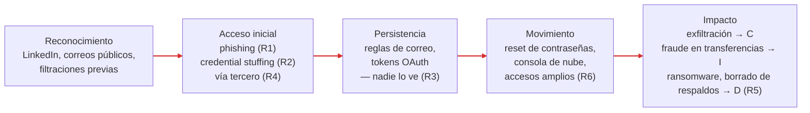

# 03 — Modelo de Amenazas

**Decisión que permite tomar este documento:** contra quién defiende FinTrack y contra quién no. Sin esa frontera, toda amenaza parece igual de urgente y el presupuesto se reparte en migajas.

---

## ¿Quién atacaría a FinTrack?

No todos los atacantes existen para todas las empresas. Una fintech de 45 personas con 28.000 clientes no atrae lo mismo que un banco sistémico.

| Actor | Motivación | ¿Aplica? | Razonamiento |
|-------|------------|----------|--------------|
| Cibercrimen oportunista | Dinero: credenciales, fraude, extorsión | **Sí** | Opera a escala con kits de phishing e infostealers comerciales. No elige a FinTrack: elige a quien caiga. Ya ocurrió una vez. |
| Grupos de ransomware | Extorsión por cifrado y filtración | **Sí** | Los afiliados compran accesos iniciales baratos (credenciales robadas). Una fintech que no puede operar paga rápido. |
| Defraudadores contra clientes | Tomar cuentas de usuarios y mover dinero | **Sí** | Credential stuffing con listas filtradas. El motor de transferencias convierte una cuenta tomada en dinero real. |
| Insider / soporte con acceso | Dinero (soborno) o resentimiento | **Parcial** | Con 45 empleados la probabilidad es baja, pero el acceso interno es amplio y sin revisión, así que el impacto sería alto. Se trata vía R6, no como actor dedicado. |
| Hacktivistas | Ideología, visibilidad | No | FinTrack no es símbolo de nada. Sin valor de tribuna. |
| Actores estatales | Espionaje, sabotaje estratégico | No | FinTrack no es infraestructura crítica ni objetivo de inteligencia. Presupuestar contra APTs sería teatro (ya excluido en `01-business-case.md`). |
| Competidores (espionaje) | Ventaja comercial | No | El riesgo real de mercado es perder clientes por una brecha, no que un competidor robe el roadmap. |

> **Perfil del atacante realista de FinTrack:** un oportunista con herramientas compradas — kits de phishing, infostealers, listas de credenciales filtradas — motivado por dinero, que ataca a miles de empresas a la vez y se queda donde encuentra la puerta abierta. No es un experto dedicado a FinTrack. No hace falta que lo sea.

---

## ¿Por dónde entraría? (cadena de ataque)

La cadena del atacante realista, con el riesgo que aparece en cada eslabón:

La lectura importante: **R3 (ceguera operativa) no es un eslabón de entrada — es lo que permite que todos los demás eslabones duren días en lugar de minutos.** En el incidente real, el atacante vivió seis días en el correo porque ningún eslabón generaba señal.

---

## ¿Qué puede salir mal? (por activo)

| Activo | Amenaza concreta | Vector realista | Riesgo |
|--------|------------------|-----------------|--------|
| A1 · BD de clientes | Exfiltración de datos financieros de 28.000 personas | Credencial de empleado robada → consola de nube → export de la BD | R1, R6 |
| A2 · Motor de transferencias | Fraude: transferencias emitidas desde cuentas tomadas | Credential stuffing → sesión válida de cliente → transferencia programada | R2 |
| A3 · Plataforma web/móvil | Indisponibilidad prolongada: cifrado o borrado de infraestructura y respaldos | Ransomware tras compromiso de la consola de nube | R5 |
| A4 · Credenciales de empleados | Toma del correo corporativo y pivote al resto | Phishing con página falsa de login (el incidente real) | R1 |
| A5 · Integraciones con terceros | Brecha del agregador o del banco socio expone datos/tokens de FinTrack | El tercero es comprometido; FinTrack se entera por la prensa | R4 |
| Transversal | Cualquiera de las anteriores, sin que nadie lo note | Ausencia de registros y alertas | R3 |

---

## Amenazas reales, 2024–2025 (mapeadas a CID y al caso)

Estos incidentes son públicos, recientes y estructuralmente idénticos a los riesgos de FinTrack. No son teoría.

| Caso | Año | Vector | Pilar CID | Qué le dice a FinTrack |
|------|-----|--------|-----------|------------------------|
| Campaña contra clientes de Snowflake (Ticketmaster, Santander, +160 org.) | 2024 | Credenciales robadas con infostealers; cuentas **sin MFA** | C | Una contraseña sola no es autenticación. Es el escenario exacto de R1/R2. |
| Change Healthcare | 2024 | Credencial robada en portal de acceso remoto **sin MFA** → ransomware; semanas de caída del sistema de salud de EE. UU. | D | El acceso inicial fue trivial; el impacto, catastrófico. R1 → R5 en una sola cadena. |
| Evolve Bank & Trust | 2024 | Ransomware (LockBit) en un banco socio de fintechs; expuso datos de clientes de Mercury, Yotta y otras | C | FinTrack depende de un banco socio y un agregador. La brecha del tercero es la brecha propia (R4). |
| Coinbase | 2025 | Agentes de soporte tercerizados sobornados; robo de datos de clientes y extorsión millonaria | C | El acceso interno amplio y sin revisión es un producto vendible (R6). |
| Salesloft Drift → clientes de Salesforce | 2025 | Tokens OAuth robados a un proveedor SaaS → acceso masivo a datos de cientos de empresas | C | Los tokens que FinTrack concede a integraciones son llaves que viven fuera de casa (R4). |
| 23andMe | 2023–2024 | Credential stuffing con contraseñas reutilizadas; datos de ~7M de usuarios | C | Los clientes reutilizan contraseñas. El login de clientes debe asumirlo (R2). |

---

## Cómo se califica el riesgo

> **Riesgo = Probabilidad × Impacto**, en escala Baja / Media / Alta.

Sin números mágicos: cada calificación se defiende con una frase en el registro (`risk-register.md`). Criterios:

- **Probabilidad** se juzga por evidencia: ¿le pasó ya a FinTrack? ¿le pasa hoy a empresas del mismo tamaño y sector? ¿requiere habilidad rara o herramientas de catálogo?
- **Impacto** se juzga contra la frase de `01-business-case.md`: dinero y datos financieros de 28.000 personas, y la confianza que sostiene el negocio.

---

## Supuestos del modelo

Un modelo sin supuestos explícitos es una opinión disfrazada. Estos son los nuestros:

1. **El proveedor de nube cumple su parte del modelo de responsabilidad compartida.** Hipervisor, datacenter y red física quedan fuera; la configuración que FinTrack hace encima, dentro.
2. **Los empleados no son maliciosos por defecto, pero sí falibles.** Se diseña para el error humano, no contra él.
3. **Los terceros pueden ser comprometidos aunque hagan bien su trabajo.** La confianza heredada se administra, no se asume.
4. **No habrá personal de seguridad dedicado en los próximos 12 meses.** Todo control debe operarlo el equipo de TI actual (4 personas).
5. **El atacante ya conoce la arquitectura genérica.** FinTrack usa componentes estándar de nube; la seguridad no puede depender del secreto del diseño.

---

## Lo que este modelo descarta

Descartar por escrito es parte del trabajo. Estas amenazas se consideraron y quedaron fuera:

| Amenaza descartada | Razón |
|--------------------|-------|
| Actores estatales / APT dedicadas | FinTrack no es objetivo estratégico. Defenderse de un APT cuesta más que toda la empresa y no cierra ningún riesgo real. |
| DDoS volumétrico sostenido | El proveedor de nube absorbe el volumen básico; FinTrack no tiene perfil de extorsión por DDoS. Si cambia el perfil público de la empresa, se revisa. |
| Exploits de día cero contra la infraestructura | Precio de mercado de seis cifras. Nadie gasta un 0-day en una empresa que aún se entra con un correo falso. Los parches (higiene básica) cubren los n-days, que sí son realistas. |
| Intrusión física a oficinas | No hay servidores en la oficina; todo activo crítico vive en la nube. Robar una laptop sí importa — se cubre en R6 (cifrado de disco), no como amenaza física independiente. |
| Ataques a la cadena de suministro de dependencias (npm) como riesgo top-6 | Real (los gusanos de npm de 2025 lo probaron), pero para FinTrack la relación costo-probabilidad lo pone detrás de los seis del registro. Se mitiga con higiene barata — lockfiles y alertas de dependencias — anotada en C6, sin categoría propia. |

---

## Siguiente documento

`risk-register.md` — los seis riesgos que salen de este modelo, calificados y priorizados.
