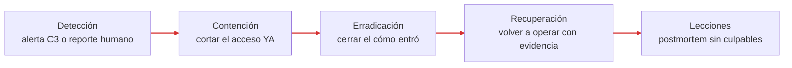

# 06 — Plan de Respuesta a Incidentes

**Decisión que permite tomar este documento:** quién hace qué en los primeros 60 minutos.

El incidente de abril se improvisó. Este plan existe para que el próximo no. Está dimensionado a la realidad de FinTrack: 4 personas de TI, sin turno nocturno, sin SOC.

---

## Roles

En una empresa de 4 personas de TI, los roles son sombreros, no puestos: una persona puede llevar dos, pero **cada sombrero tiene siempre un dueño nombrado**. Lo que no puede pasar es que todos investiguen y nadie decida.

| Rol | Responsabilidad | Quién |
|-----|-----------------|-------|
| Coordinador del incidente | Declara el incidente, asigna sombreros, decide contención, es la única voz hacia dirección | Responsable de infraestructura (suplente: dev senior) |
| Investigación técnica | Contiene y analiza: sesiones, registros, alcance | Los 2 desarrolladores |
| Registro (escriba) | Anota TODO con hora: qué se vio, qué se hizo, quién lo decidió. Sin esto no hay postmortem | Soporte |
| Comunicación y decisiones de negocio | Habla con clientes, terceros, abogados y — si toca — autoridades. Decide sobre notificaciones legales | CTO / dirección (no está en TI: se le escala) |

Regla de oro: **quien detecta no decide la gravedad solo.** Reporta al coordinador y el coordinador clasifica.

---

## Clasificación de severidad

| Nivel | Definición | Ejemplo FinTrack | Respuesta |
|-------|------------|------------------|-----------|
| SEV-1 | Dinero movido, datos de clientes confirmados fuera, o plataforma caída | Transferencias fraudulentas emitidas; BD exfiltrada; ransomware | Todos los sombreros, dirección al teléfono, ahora |
| SEV-2 | Acceso indebido confirmado, sin impacto confirmado aún | Cuenta de correo comprometida (el caso de abril) | Coordinador + investigación, dirección informada en <2 h |
| SEV-3 | Intento sin acceso confirmado | Campaña de phishing reportada a tiempo, stuffing bloqueado | Playbook correspondiente, registro, sin escalado |

---

## Fases

### 1. Detección
Llega por dos vías: una alerta de C3 (login imposible, regla de reenvío, borrado de respaldos…) o un reporte humano al canal **#seguridad** o al teléfono del coordinador. Quien detecta anota la hora y NO toca nada más. El coordinador clasifica severidad en los primeros 15 minutos con lo que haya — la clasificación se corrige después si hace falta, pero no se espera a tener certeza.

### 2. Contención
Objetivo: que el atacante pierda el acceso **ahora**, aunque aún no se entienda todo. En FinTrack eso significa, según el caso: suspender la cuenta y revocar todas sus sesiones y tokens (suite de correo/SSO), rotar credenciales de la consola de nube, revocar llaves de API de terceros, o aislar la instancia afectada. Contener antes de entender: un atacante observado "para aprender de él" es un lujo de empresas con SOC, no de FinTrack.

### 3. Erradicación
Cerrar el **cómo entró**, no solo el acceso: eliminar reglas de correo y OAuth grants creados por el atacante, buscar el mismo correo/artefacto en las otras 44 bandejas, verificar que no haya credenciales adicionales comprometidas (¿la contraseña robada se usaba en otro sistema?), parchear o reconfigurar lo que lo permitió.

### 4. Recuperación
Restablecer el servicio y los accesos legítimos desde estado limpio (respaldos de C5 si hubo daño), con vigilancia reforzada 2 semanas sobre lo afectado. Antes de declarar cerrado: el coordinador confirma con evidencia de los registros (C3) que no hay actividad residual — "parece que ya" no cierra un incidente.

### 5. Lecciones aprendidas
Postmortem sin culpables dentro de los 5 días hábiles siguientes, con la plantilla de `07-postmortem/`. Toda acción correctiva sale con dueño y fecha, y se traza al riesgo R# que cierra. Un postmortem sin acciones con dueño es una ceremonia.

---

## Cómo escalar

Se escala a dirección (CTO/CEO), por teléfono — no por el correo, que puede estar comprometido — cuando se cumple **cualquiera** de estos disparadores:

- Hay indicios de dinero movido o alterado (SEV-1 automático).
- Hay indicios de datos de clientes accedidos o exfiltrados → dirección decide con el abogado sobre obligaciones de notificación a clientes y autoridad de protección de datos. **Esa decisión nunca la toma TI sola.**
- La plataforma lleva más de 2 horas caída.
- Un tercero del inventario (agregador, banco socio) está involucrado → hay que activar sus contactos de seguridad.
- Un medio, cliente o red social pregunta por el incidente.

Canal de coordinación del incidente: el canal de mensajería del equipo **más el teléfono**. Si el incidente toca la suite de correo/mensajería, la coordinación pasa a teléfono y a un grupo de mensajería personal predefinido — decidir el canal alternativo durante el incidente es tarde.

---

## Contactos

| Quién | Rol en el incidente | Cuándo se le llama |
|-------|--------------------|--------------------|
| CTO / dirección | Decisiones de negocio y legales | Todo SEV-1 y SEV-2 |
| Asesor legal externo | Obligaciones de notificación (datos personales, regulador financiero) | Indicios de datos de clientes expuestos |
| Contacto de seguridad del agregador bancario | Revocar/rotar tokens, pedir registros de su lado | Incidente que toque la integración (R4) |
| Contacto del banco socio | Congelar/revertir transferencias sospechosas | Indicios de fraude en transferencias |
| Soporte del proveedor de nube | Registros adicionales, recuperación de cuenta | Compromiso de la consola de nube |
| Autoridad de protección de datos / CERT nacional | Notificación regulatoria | Solo vía dirección + abogado |

Los números viven impresos y en el gestor de contraseñas — no solo en el correo, por la misma razón que el canal alternativo.

---

## Siguiente documento

`playbook-phishing.md` — el procedimiento paso a paso para el incidente más probable (R1).
